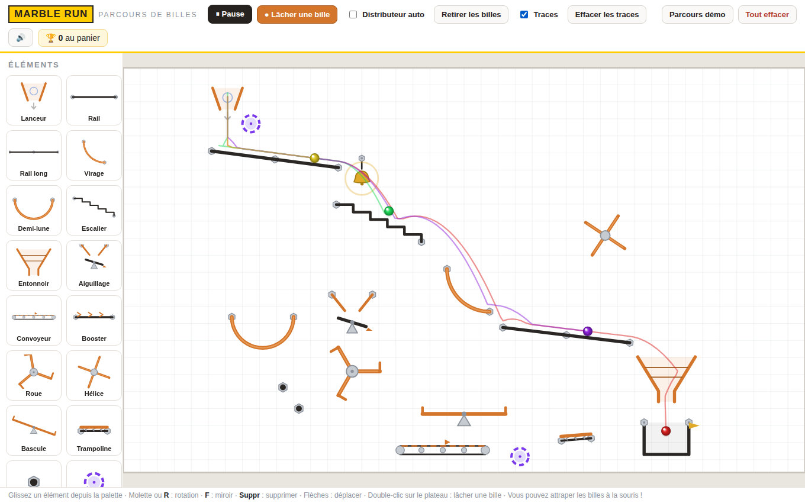

# Marble Run Gravity 🔵

Un jeu de construction de parcours de billes en 2D, vu de côté, inspiré des
jeux de type « marble run » magnétiques. Placez des éléments sur le plateau,
lâchez des billes et regardez la gravité faire le reste !

**🎮 Jouer en ligne : <https://renaar.github.io/Marble-Run-Gravity/>**
(fonctionne aussi sur iPad et mobile, tout est utilisable au doigt)



## Jouer en local

Aucune installation, aucune dépendance : ouvrez simplement `index.html`
dans un navigateur.

```bash
# ou, pour servir le jeu en local :
npx serve .
# puis ouvrir http://localhost:3000
```

## Les éléments

| Élément | Effet |
|---|---|
| **Lanceur** | Trémie d'où tombent les billes (bouton « Lâcher une bille » ou distributeur automatique) |
| **Rail / Rail long** | Rails inclinables sur lesquels les billes roulent |
| **Virage** | Quart de cercle qui réceptionne une chute et relance la bille à l'horizontale |
| **Demi-lune** | Half-pipe dans lequel les billes oscillent |
| **Escalier** | Les billes rebondissent de marche en marche |
| **Entonnoir** | Canalise les billes vers son goulot |
| **Aiguillage** | Envoie les billes alternativement à droite puis à gauche |
| **Convoyeur** | Tapis roulant qui transporte les billes (même à contre-pente) |
| **Booster** | Rail motorisé qui propulse les billes dans son sens |
| **Roue** | Tourne librement sous le poids et les impacts des billes |
| **Hélice** | Tourne en continu et projette les billes qui la touchent |
| **Bascule** | Planche à pivot qui penche quand une bille s'y pose |
| **Trampoline** | Propulse les billes vers le haut |
| **Tige** | Simple picot sur lequel les billes rebondissent (façon pachinko) |
| **Portail** | Les portails vont par deux : une bille qui entre dans l'un ressort de l'autre |
| **Cloche** | Tinte et se balance au passage d'une bille |
| **Panier** | L'arrivée : chaque bille récupérée marque un point |

## Commandes

- **Glisser-déposer** un élément de la palette vers le plateau
- **Clic** sur un élément : le sélectionner (puis le déplacer à la souris)
- **Molette** ou **R** / **Maj+R** : rotation — **F** : miroir — **Suppr** : supprimer
- **Flèches** : déplacement fin (**Maj** pour aller plus vite)
- **Double-clic** sur le plateau : lâcher une bille à cet endroit
- **Attraper une bille** à la souris pour la déplacer ou la lancer
- **Espace** : pause / reprise de la physique
- **Traces** : chaque bille a sa propre couleur ; cochez « Traces » pour
  afficher la trajectoire parcourue par chacune (dans sa couleur), et
  « Effacer les traces » pour repartir de zéro

Sur **écran tactile** (iPad, mobile) : glissez les éléments au doigt, touchez
un élément pour afficher les boutons pivoter / miroir / supprimer, et
**touchez deux fois** le plateau pour lâcher une bille.

Le parcours est **sauvegardé automatiquement** dans le navigateur
(`localStorage`) ; le bouton « Parcours démo » restaure le circuit d'exemple.

## Sous le capot

- HTML5 Canvas + JavaScript vanilla, sans aucune dépendance.
- Moteur physique maison : intégration à sous-pas fixes, collisions
  bille ↔ segment avec restitution et frottement, collisions entre billes,
  et éléments rotatifs (roue, bascule) entraînés par le couple des impacts
  (approche en coordonnées généralisées : `τ = −impulsion · ∂P/∂θ`).
- Sons générés à la volée en WebAudio (aucun fichier audio).
- Monde de taille fixe (1280 × 760) mis à l'échelle de l'écran, ce qui rend
  les sauvegardes indépendantes de la résolution.

## Structure du code

```
index.html      Page et barre d'outils
css/style.css   Habillage de l'interface
js/elements.js  Banque d'éléments : géométrie de collision + dessin
js/game.js      Moteur : physique, rendu, sons, score
js/ui.js        Palette, glisser-déposer, clavier, sélection
js/main.js      Parcours démo, sauvegarde auto, boucle de jeu
```
